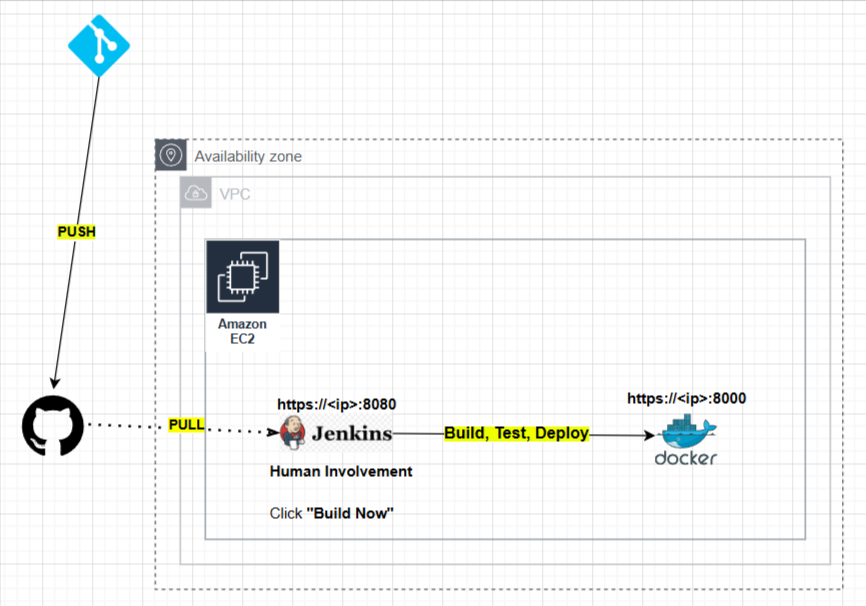
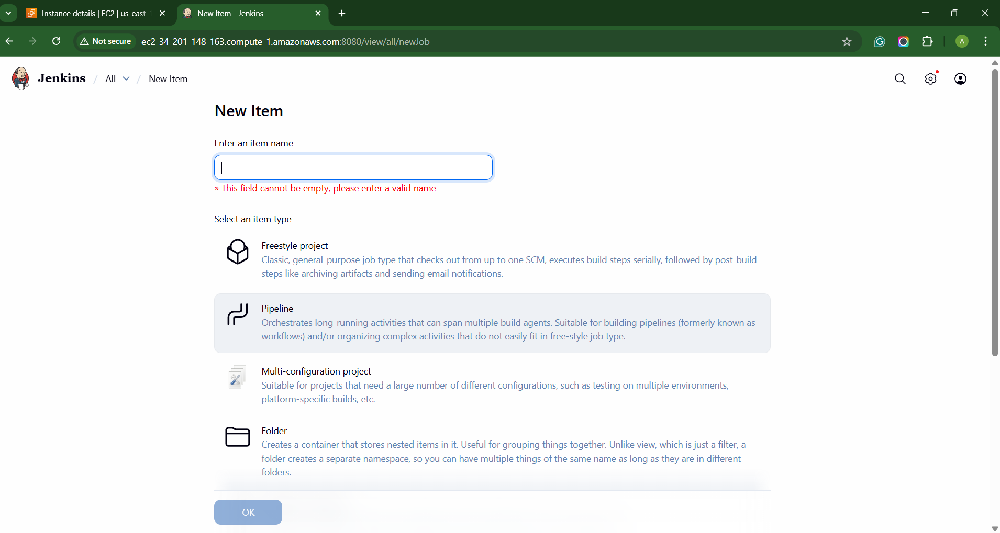
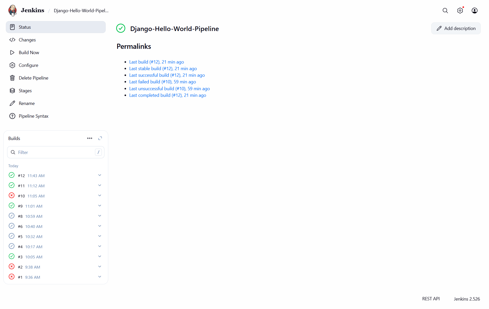
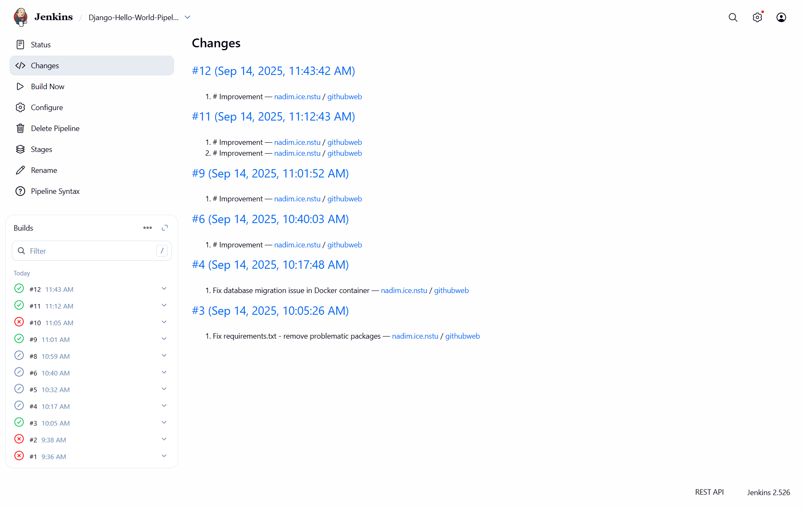
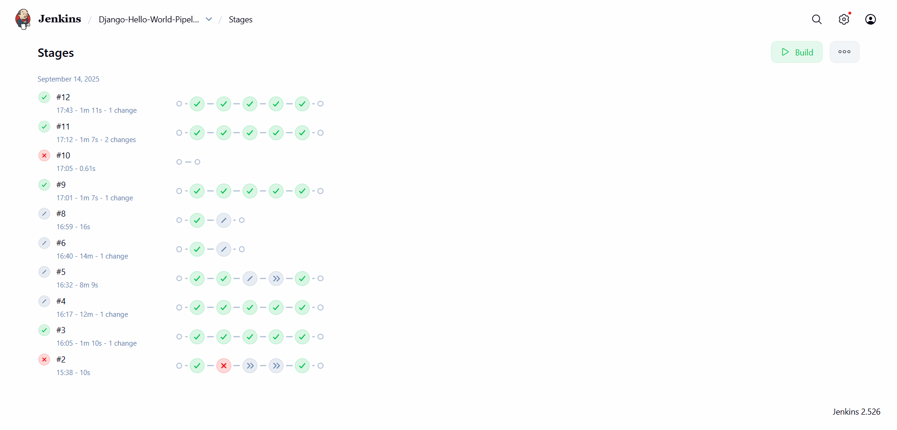
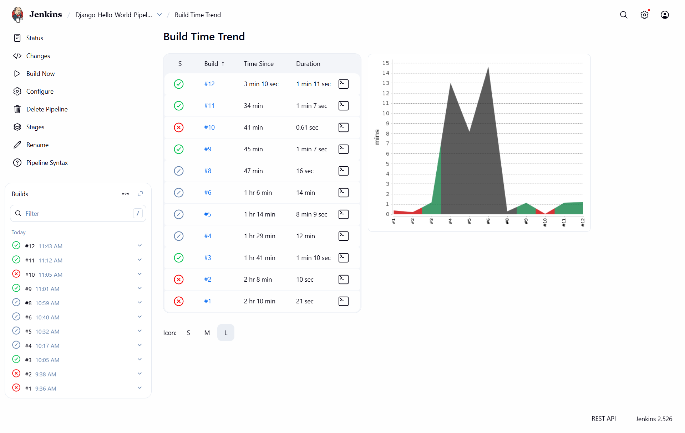

# django jenkins pipeline

## Jenkins


## My Django Jenkins CI/CD Pipeline


## Installation on EC2 Instance
- Install Jenkins, configure Docker as agent, set up cicd, deploy applications

## AWS EC2 Instance
- Go to AWS Console
- Instances(running)
- Launch instances
- Make sure your EC2 instance's security group allows inbound traffic on port 8000(Django) and 8080(Jenkins);

## Install Jenkins.
```bash
# Run the below commands to install Java and Jenkins

# Install Java
sudo apt update
sudo apt install openjdk-17-jre

# Verify Java is Installed
java -version


curl -fsSL https://pkg.jenkins.io/debian/jenkins.io-2023.key | sudo tee \
  /usr/share/keyrings/jenkins-keyring.asc > /dev/null
echo deb [signed-by=/usr/share/keyrings/jenkins-keyring.asc] \
  https://pkg.jenkins.io/debian binary/ | sudo tee \
  /etc/apt/sources.list.d/jenkins.list > /dev/null
sudo apt-get update
sudo apt-get install jenkins


ps -ef | grep jenkins
```

## Login to Jenkins using the below URL:
- http://:8080 [You can get the ec2-instance-public-ip-address from your AWS EC2 console page]
```bash
# Jenkins Admin Password
sudo cat /var/lib/jenkins/secrets/initialAdminPassword
```

## Install the Docker Pipeline plugin in Jenkins:
- Log in to Jenkins.
- Go to Manage Jenkins > Manage Plugins.
- In the Available tab, search for "Docker Pipeline".
- Select the plugin and click the Install button.
- Restart Jenkins after the plugin is installed.

# Docker Slave Configuration
```bash
sudo apt update
sudo apt install docker.io

# Grant Jenkins user and Ubuntu user permission to docker deamon.
sudo su - 
usermod -aG docker jenkins
usermod -aG docker ubuntu
systemctl restart docker

# restart Jenkins.
http://<ec2-instance-public-ip>:8080/restart

# check
su - jenkins
docker run hello-world
```

## Jenkins Configuration (Pipeline Job)
### Create a New Pipeline Job in Jenkins:

- Open Jenkins Dashboard
- Click "New Item"
- Enter name: "Django-Hello-World-Pipeline"
- Select "Pipeline"
- Click "OK"


### Configure the Pipeline:

- In the job configuration, scroll to "Pipeline" section
- Select "Pipeline script from SCM"
- SCM: Git
- Repository URL: https://github.com/aa-nadim/django_jenkins_pipeline
- Branch: */main (or */master depending on your default branch)
- Script Path: Jenkinsfile
- Save the configuration

## UI Setup





## Test it locally first:
```bash
python -m venv .venv
.venv/Scripts/activate
source .venv/bin/activate

pip install -r requirements.txt

python manage.py makemigrations
python manage.py migrate

# Test your Django app
python manage.py test hello.tests -v 2
python manage.py runserver

```
## Test Docker build locally:
```bash
# Test Docker build with new requirements
docker build -t test-django .

# If successful, test run:
docker run -p 8000:8000 test-django
```
## 1. If local Docker build works, commit and push:








## 2. http://<ip>:8000
